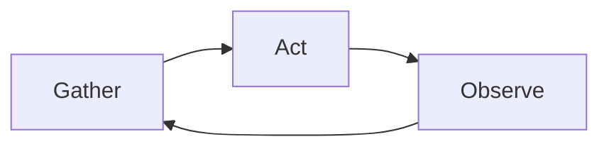
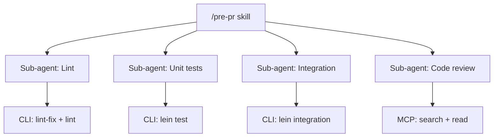
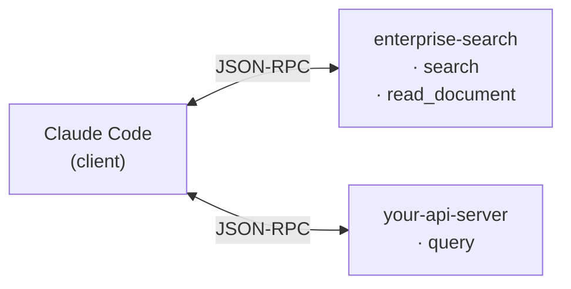
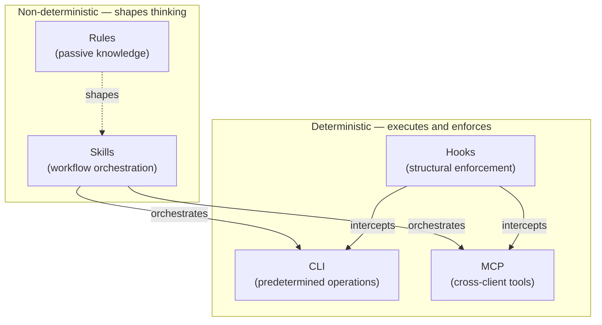

# Building Your AI Toolkit

**AI agents are not text completers. They are runtime loops.** What's an agent?
How is it different from autocomplete? What are rules, skills, hooks — and when
do you use each one? Once that clicks, the rest follows.

## What an agent actually is

An agent is a loop where the model plans, acts, and self-corrects — not just
responding to a prompt, but executing a sequence of decisions. The loop:



Here's that loop running a pre-PR pipeline on a branch with 24 changed files:

```
User: "let's wrap this up"

GATHER
  CLI  git summary → branch · 24 files · 8 backend + 4 test · 2 commits

ACT (4 sub-agents in parallel)
  Lint        → lint-fix + lint → 0 errors · 0 warnings
  Unit        → lein test → 21 tests · 151 assertions → PASS
  Integration → lein integration → 5 tests · 6 assertions → PASS
  Code review → reads architecture rules + fetches story criteria
              → 2 warnings: missing validation, undocumented field

OBSERVE
  ✅ Lint — clean
  ✅ Unit — 21 pass
  ✅ Integration — 5 pass
  ⚠️ Code review — 2 warnings
  ✅ Story — all criteria met

HUMAN GATE
  "UserProfile should use strict validation. Here's the fix: ..."
  [ Accept ] [ Dismiss ]
```

The agent made a dozen decisions: which tools to run, what to parallelize, how
to prioritize the warnings, when to stop and ask. It ran a dozen commands. I
typed seven words.

Same loop, entirely different task:

```
User: "prep for my 1:1 with Ana"

GATHER
  reads last 14 daily notes
  searches issue tracker for active cards
  reads Ana's person file (role, last topics, working style)

ACT
  synthesizes into a relationship-first prep doc:
  - Recent context: what you've been working on
  - Team dynamics: anything relevant to surface
  - Growth angle: what's worth discussing for career development
  - Conversation openers: specific, not generic

HUMAN GATE
  "Here's your prep. Want me to adjust anything?"
```

Same loop. Same building blocks. No new code — just the same patterns applied to a different problem.

**The loop doesn't care what kind of task it's running.** Gather, act, observe,
repeat. Whether the task is running tests or drafting meeting prep, the
architecture is identical. Claude Code and Cursor are not autocomplete tools —
they plan, act, observe, and self-correct. That's what makes them agents.

## The five building blocks

The agent is the runtime. What it composes from are five layers.

### Rules — the passive knowledge

Rules are markdown files that load into context automatically. The agent never
"calls" them — it absorbs them. Your project `CLAUDE.md` describes conventions.
An architecture doc describes your layering rules. A coding standards file
describes naming conventions.

**A short rules file silently prevents an entire class of mistakes.** Put your
architecture decisions in a rules file once; every session that follows benefits
from them without you repeating yourself.

### Skills — the workflow brain

Skills are prompt files (`SKILL.md`) that teach the agent how to think about a
task. They're actively invoked by name: `/pre-pr`, `/meeting-prep`, `/standup`.
They orchestrate multi-step workflows, define what information to gather, and
specify where human checkpoints belong.

**Rules are absorbed. Skills are invoked.** Rules shape every session
passively. Skills activate for specific workflows — they decide *what* to
execute, *when* to connect to external systems, and *where* to pause for human
input. "When preparing for a 1:1, gather the last two weeks of notes, check the
issue tracker for anything blocked, read the person file for context — then
draft, don't deliver." That's a skill.

Skills are the orchestration layer above CLI and MCP. This is what makes the
pre-PR pipeline possible — the skill tells the agent to dispatch four sub-agents
in parallel, each running CLI commands in the background, while the agent
narrates progress and synthesizes results. That parallelism, that narration,
that async coordination — none of it is possible through MCP, which blocks on
every call. Skills run inside the model's context, which means the model can
plan, branch, and react in real time.



Here's the thing about skills: I didn't write most of mine by hand. I described
the workflow in conversation — "when I say `/meeting-prep`, gather the last two
weeks of notes, check the issue tracker, read the person file" — and the agent
drafted the skill file. I refined it, tested it, iterated. The feedback loop is
minutes: edit a markdown file, reload, try again. No server to build, no schema
to validate, no deployment.

### CLI — the deterministic anchor

CLI tools are predetermined operations. `git commit` commits. `lein test` runs
tests. Same input, same output, every time.

The agent *chooses when* to call them — but the command does the same thing
regardless. This is the key: CLI is not "simple." It's *deterministic*. You use
CLI when you need the operation to behave identically every time, regardless of
context or what the model thinks it knows.

Not limited to code either. Fetch issues from your tracker, generate a standup,
check your calendar. If it can run in a shell and return a predictable result,
it belongs in CLI.

### MCP — the cross-client protocol

MCP (Model Context Protocol) lets AI agents call external tools over a
standardized JSON-RPC interface. You define a server once; it works in Claude
Code, Cursor, VS Code, and any other MCP-compatible client.
Anthropic [describes it as USB-C for AI](https://www.anthropic.com/news/model-context-protocol).

Each MCP tool is self-describing — it carries its name, description, and
parameter schema. The agent reads the descriptions, decides which tools are
relevant, and calls them with structured parameters.



**The first tradeoff is context cost.** MCP tool responses are often verbose
JSON — a single search result can return thousands of tokens of metadata the
agent doesn't need. Every token in a tool response competes with your
conversation, your code, and your instructions for space in the context window.
When using MCP, design your servers to return focused responses, not raw API
dumps.

**The second tradeoff is blocking.** Every MCP tool call blocks the agent until
it returns — no progress updates, no intermediate state, no parallelism. A CLI
command can run in the background while the agent continues working. A skill can
dispatch sub-agents that run concurrently. MCP can't. The moment a workflow
needs duration or parallelism, MCP breaks the experience.

Use MCP when you need cross-client portability, when the AI should discover
available capabilities at runtime, or when you're bridging to external systems
with atomic, fast operations. Prefer CLI when you need a fast, predictable
result without the context overhead. Prefer skills when you need orchestration,
progress, or parallelism — skills orchestrate both CLI and MCP tools, which is
the correct mental model: skills as the workflow brain on top of both.

### Hooks — the structural enforcer

Hooks fire at lifecycle points — before a tool runs, after it succeeds, when the
session ends. A `PreToolUse` hook can block operations before they execute. A
`PostToolUse` hook can redirect behavior after a tool call.

The critical insight:
**instructions are suggestions the model may ignore under pressure. Hooks are structural enforcement.**

A `CLAUDE.md` instruction like "always run tests before committing" competes
with everything else in the context window — the conversation, the code, the
tool results. The longer the session, the more that instruction has to compete
with. A hook doesn't compete. It runs as code, outside the model's context, on
every tool call. The model doesn't need to remember the constraint — the hook
enforces it whether the model is paying attention or not.

Start with rules for guidance. Escalate to hooks when you find a rule that keeps
getting ignored. And once you have hooks, you have an event layer — every tool
call becomes an observable event you can log, validate, and react to. Hooks are
the foundation for enforcement *and* observability.

### The intelligence-determinism split

The five layers split along one axis:



Skills sit above the deterministic layer — they orchestrate CLI and MCP tools,
not alongside them. Rules load passively into the agent's context, shaping how
skills reason. Hooks intercept tool calls from below, enforcing constraints
regardless of what the skill or model decided.

You don't want the agent deciding whether to run your tests. You want it to
*always* run your tests. CLI is the right layer. You do want the agent deciding
how to frame your 1:1 prep based on context. Skills are the right layer.

The split also determines where to debug. If a CLI command returns the wrong
result, debug the command. If the agent makes a bad decision, look at the skill
or rule that shaped the decision.

## Why this architecture runs on markdown

Three of the five layers are just markdown files:

| File        | What it is           | What it *also* is                    |
| ----------- | -------------------- | ------------------------------------ |
| `SKILL.md`  | Human-readable guide | Agent's workflow instructions        |
| `CLAUDE.md` | Project README       | AI's identity file                   |
| `RULES.md`  | Coding standards     | Passive context loaded every session |

This is not accidental. Markdown is the default format for AI agents for the
same reason JSON became the default for web APIs: every LLM was trained on
vast amounts of markdown, they generate it natively, and humans can read and
edit it without tooling.

The token economics reinforce it.
[Per Cloudflare's data](https://blog.cloudflare.com/markdown-for-agents/),
a markdown heading costs ~3 tokens; the HTML equivalent costs 12-15 — a 4-5x overhead.
Across an entire rules file
or skill definition loaded into context, the savings compound. When context
window space is your most constrained resource, format choices are architectural
choices.

The deeper point: markdown is simultaneously documentation *and* executable
configuration. A `SKILL.md` is both a human-readable guide and the agent's
workflow instructions. A `CLAUDE.md` is both a project README and the AI's
identity file. No other format serves both constituencies. JSON configs are
unreadable. YAML is not documentation.

If your AI system is not markdown-native, you're fighting the current.

## 36% code, 64% everything else

Here's the number that reframed how I use all of this: of the skills I've
built, only 36% are about writing or reviewing code. The other 64% handle
everything else an engineer does:

| Category              | What they do                                                      |
| --------------------- | ----------------------------------------------------------------- |
| Morning briefing      | Synthesize calendar, active issues, messages → prioritized day plan |
| Meeting prep          | Relationship-first 1:1 prep from notes, issues, comm history      |
| Standup generation    | Yesterday's journal + today's plan → paste-ready async update     |
| Career growth         | Career level gap analysis, expectations drafting, evidence synthesis |
| Issue triage          | Search mentions by priority, draft replies                        |

The career growth skill is the one that surprises people most. Here's what it
looks like: I invoke the skill, and the agent reads my career level
expectations, searches my journal for the last two weeks of evidence,
cross-references with my manager's feedback notes, identifies gaps between
where I am and where the next level expects me to be — and drafts a prep doc
I can bring to my next 1:1. The same gather-act-observe loop, applied to career
development instead of code.

Every one of these skills was designed by me and implemented by the agent. I
described the workflow; it drafted the file.

These are the tasks that eat your day in 15-minute slices: context-switching
between your issue tracker, messages, calendar, and notes. An agent with the
right skills collapses that context-switching into a single invocation.

**An agent that only helps you write code is ignoring most of your job.**

## The role shift: from doer to architect

What changes when you think about AI this way: the role shifts from doing the
work to designing the workflow.

Three questions become your job:

1. What information does this workflow need?
2. What decisions require a human?
3. Where are the repetitive steps the agent should handle?

Every skill in my toolkit was designed by me and drafted by the agent. I acted
as architect — defining what each workflow needed, where the human gates belong,
what information to gather. The agent implemented it. CLI, MCP, Skills, Rules,
and Hooks are the building blocks. Markdown is the format they share.

*Next in this series: why filling your knowledge base with notes makes your AI agents less accurate — not more.*
